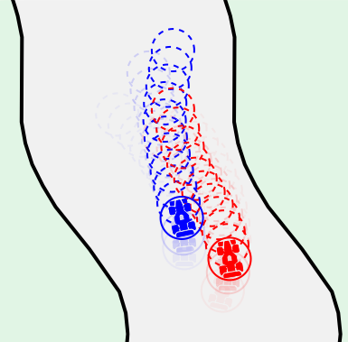

<br />
<p align="center">
	
  <p align="center">
  </p>
</p>

# About EpecRacing

This repository implements a competitive two-player vehicle racing and a solver for nonlinear, constrained bilevel optimization.

We set up two-player racing as an equilibrium problem. We define cost and constraints to describe simplified aerodynamic drag, aerodynamic drafting, position-dependent collision-avoidance, and the road.  We use our model to explore how different solution concepts affect competitiveness. 

This repository supplements our corresponding conference paper at ICRA 2025.

# Usage

Simple usage example is available in [```examples/racing_example.jl```](examples/racing_example.jl)
```julia
using EpecRacing
probs = setup()
sim_results = solve_simulation(probs, time_steps; x0, road, mode):
```

The solution concepts are enumerated using the ```mode``` ID, defined as: 
| Mode ID | Player 1 | Player 2 |
|---|---|---|
|1|SP|SP|
|2|SP|NE|
|3|NE|NE|
|4|SP|Leader|
|5|NE|Leader|
|6|Leader|Leader|
|7|SP|Follower|
|8|NE|Follower|
|9|Leader|Follower|
|9|Follower|Follower|

<!--```
Modes:
						P1:						
				SP NE P1-leader P1-follower
			SP  1              
P2:			NE  2  3
	 P2-Leader  4  5  6 
   P2-Follower  7  8  9			10
``` -->

Simulation results can be visualized using:
```julia
animate(probs.params, sim_results; mode, road)
```

Utilities to set up and solve experiments (batch run of simulations) are also available. There is an example on how to do this in [```examples/experiment_example.jl```](examples/experiment_example.jl):
```julia
probs, x0s, roads, params = create_experiment(sample_size)
results, elapsed = solve_experiment(probs, x0s, roads, time_steps, mode)
```

# License

Distributed under the MIT License. See LICENSE for more information.

# Citation

```
@misc{cinar2024doesbileveloptimizationresult,
      title={Does bilevel optimization result in more competitive racing behavior?}, 
      author={Andrew Cinar and Forrest Laine},
      year={2024},
      eprint={2402.09548},
      archivePrefix={arXiv},
      primaryClass={cs.GT},
      url={https://arxiv.org/abs/2402.09548}, 
}
```
